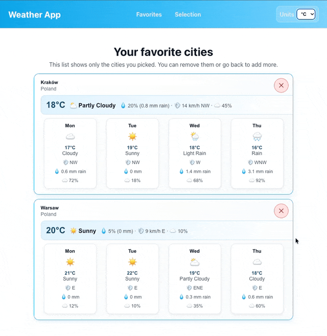

# Web Weather App



## Opis projektu

Aplikacja prezentuje prognozę pogody dla wybranych miast, widok szczegółów prognozy,
obsługę ulubionych lokalizacji oraz zmianę jednostek temperatury. Frontend został
przygotowany w React + Vite, a lokalne API i uruchomienie produkcyjne są dostępne
przez Docker Compose.

## Instrukcja uruchomienia projektu

### Wersja produkcyjna (Docker Compose)

1. Zbuduj i uruchom kontenery:
   ```bash
   docker compose up --build
   ```
2. Aplikacja frontend będzie dostępna pod adresem:
   `http://localhost:3000`
3. API działa pod adresem:
   `http://localhost:8080/api/health`

### Wersja developerska (lokalnie)

1. Uruchom bazę danych i API:
   ```bash
   docker compose up db api
   ```
2. W osobnym terminalu uruchom frontend:
   ```bash
   npm install
   npm run dev
   ```
3. Frontend będzie dostępny pod adresem:
   `http://localhost:3000`

## Podział pracy

- Amadeusz Skorupka: konfiguracja projektu, podstawowe pliki HTML/JS, zależności i ustawienia repozytorium.
- Mateusz Polarczyk: widoki aplikacji, komponenty prognozy pogody, lista miast i szczegóły prognozy.
- Agnieszka Skoczylas: dokumentacja projektu, opis uruchomienia i porządkowanie materiałów projektowych.
- Grzegorz Bielecki: konfiguracja Docker, Docker Compose, nginx oraz lokalne API.

